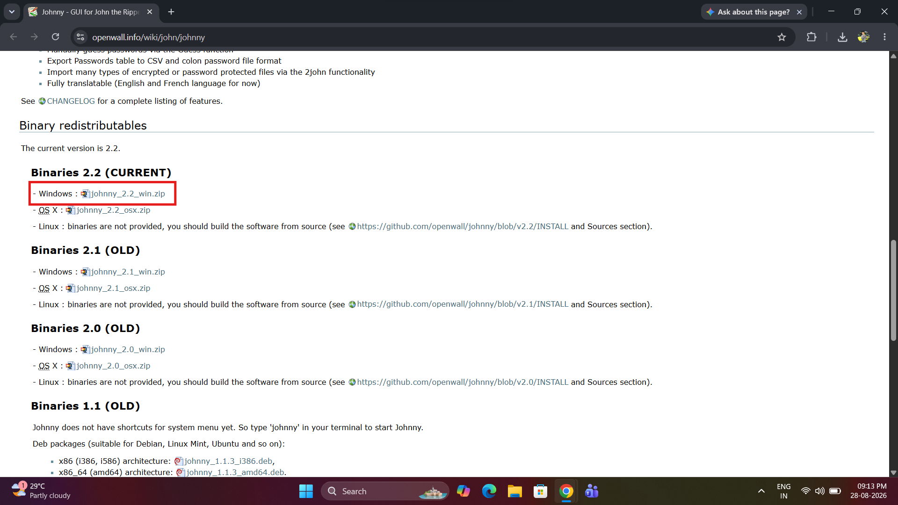
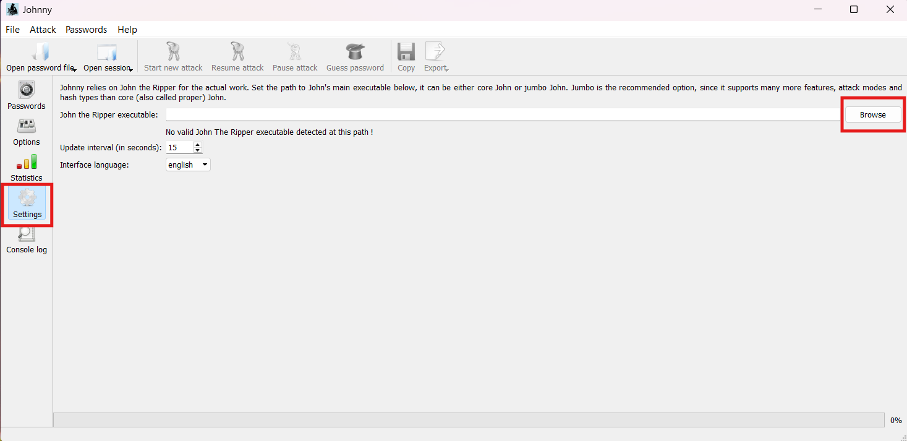
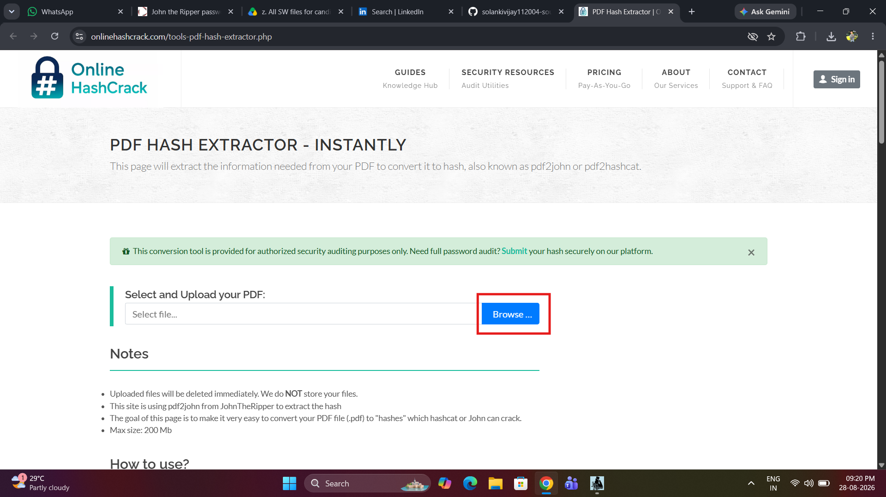
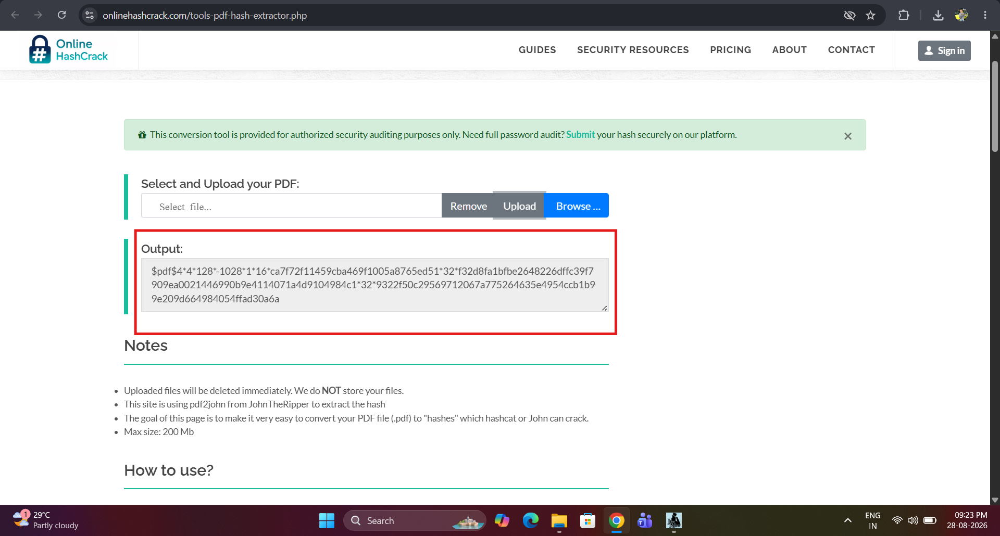
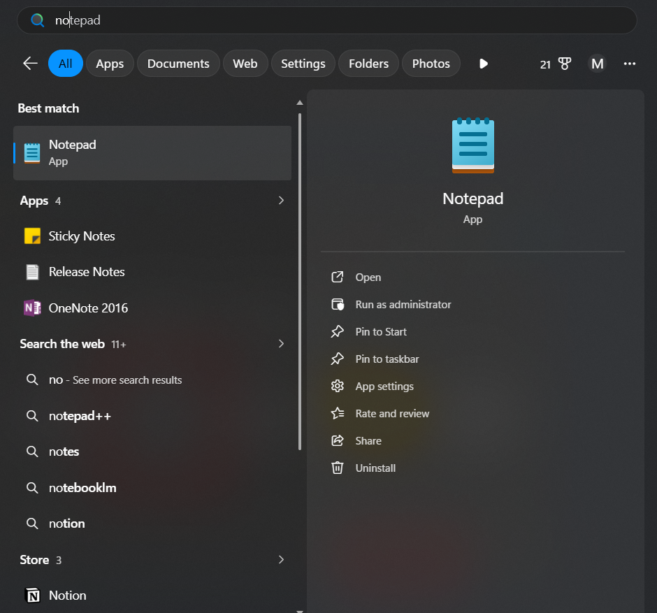
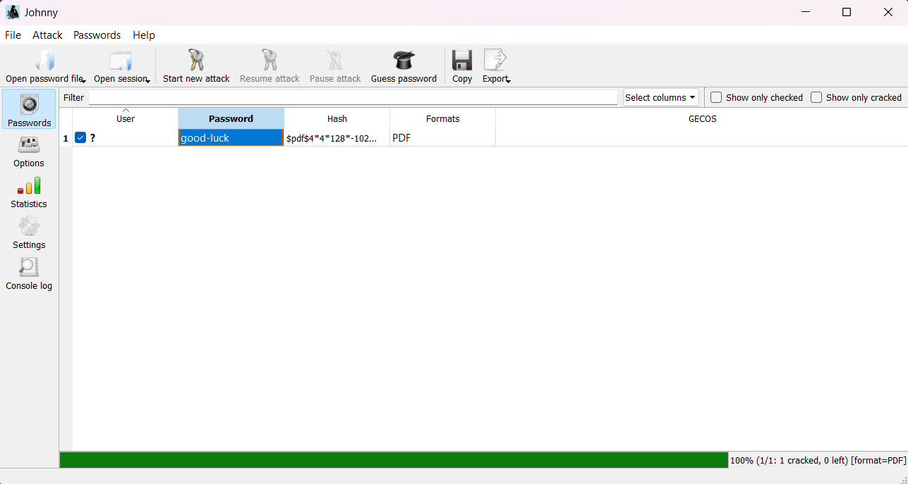

# networkwalks-B082-week3-Password-Cracking-with-John-the-Ripper

# 🔐 Password Cracking with John the Ripper

### Recovering a Password-Protected PDF Using JTR (John) and Johnny GUI

  ---
> ⚠️ **For education and research only**, against a training-provided sample file.  
> Only use these steps on files/accounts you own or have written permission to test.

---
## 📋 Overview

The Password Recovery with John the Ripper, demonstrates a hands-on password-recovery exercise using a password-protected PDF file, My Locked PDF1.pdf. The module introduces John the Ripper (JTR) and its graphical front-end, Johnny, on a Windows environment.

It covers the complete password-recovery workflow, including JTR and Johnny setup, password-hash extraction, hash import, automated password-cracking techniques, and password verification. The exercise is designed to provide practical understanding of how password-protected files can be assessed using authorized security-testing tools.

All activities are performed using free and publicly available tools within an authorized learning environment, with no programming or specialized hardware required.

---

## 🛠️ Requirements

- Windows PC (JTR also comes pre-installed on Kali Linux — skip the download step if you're on Kali)
- Internet connection (for the online hash extractor and downloads)
- Adobe Acrobat Reader, or any PDF reader that supports password entry
- The target file — a password-protected PDF you own or are authorized to test

---

## ⚙️ Installation & Setup

### Step 1 — Go to the official [Openwall John the Ripper](https://www.openwall.com/john/) pagea and Install John the Ripper.
   
   
---
### Step 2 — Go to the official [Johnny wiki page](http://openwall.info/wiki/john/johnny) and Install the Johnny GUI.   

---
### Step 3 — Link Johnny to John the Ripper
1. Open Johnny. On first launch it will say no valid JTR executable was found — this is expected.
2. Go to **Settings → Browse**.
   

3. Navigate into the extracted JTR folder and select `john.exe` inside the `run` subfolder.
   
   
4. Johnny should now confirm it has detected John the Ripper (e.g. version `1.9.0-jumbo-1`). If it doesn't, double-check you pointed it at the `run` folder, not the top-level archive folder.
   

---

## ▶️ Running the Attack

### Step 4 — Extract the hash from the PDF
1. Open [onlinehashcrack.com's PDF hash extractor](https://onlinehashcrack.com/tools-pdf-hash-extractor.php).
   

2. Upload your locked PDF and click **Upload**.
   

3. Copy the full output — it should start with `$pdf$`.
   

> ⚠️ **Privacy note:** uploading a file to a third-party site means it leaves your machine. Only do this with non-sensitive training files — never with confidential or production documents. For real sensitive files, use a local/offline pdf2john utility instead.

---
### Step 5 — Save and load the hash
1. Paste the copied hash into Notepad and save it as `hash1.txt`. Make sure it starts cleanly with `$pdf$` with no extra characters or line breaks.

2. In Johnny, go to **Open password file** and select `hash1.txt`.
   

---
### Step 6 — Start the attack
1. Click **Start new attack**.

2. When it hits 100%, check the **Password** column — the recovered plaintext will be shown next to the hash.
   

---
### Step 7 — Unlock the original PDF
1. Open the original locked PDF in Adobe Acrobat Reader (or your PDF viewer) and  Enter the recovered password when prompted.

2. If the file opens, the attack chain is verified end to end.
   

---

## 📊 Result Summary

| Stage | Tool / Method | Result |
|---|---|---|
| Hash extraction | `onlinehashcrack.com` (pdf2john) | Hash returned in `$pdf$4*4*128*…` format |
| Hash import | Johnny — Open password file | Auto-identified as PDF format |
| Attack execution | Johnny + JTR 1.9.0-jumbo-1 | 100% complete, 1 of 1 hash cracked |
| Password recovered | — | `good-luck` |
| Verification | Adobe Acrobat Reader DC | PDF opened successfully |

**Why it cracked so fast:** `password1` is a dictionary word + single digit — one of the most common human password patterns, and exactly what JTR's default wordlist/rule set is tuned to catch first. A long, random passphrase would resist this same attack for a much longer time, or indefinitely against a pure wordlist approach.

---

## 🔎 Troubleshooting Tips

- **Johnny can't find `john.exe`** → make sure you're pointing at the `run` folder inside the extracted JTR archive, not the parent folder.
- **Hash doesn't load / wrong format** → re-copy the hash, making sure nothing was truncated and it begins exactly with `$pdf$`.
- **Attack finishes with 0 cracked** → the password isn't in JTR's default wordlist/rules; try a larger wordlist or a rule-based/brute-force mode.
- **PDF still won't open with the recovered password** → double-check for trailing spaces or line breaks copied into the password field.

---

## 🔐 Encryption vs. Hashing — Key Differences

| **Encryption**                                                               | **Hashing**                                                      |
| ---------------------------------------------------------------------------- | ---------------------------------------------------------------- |
| 🔄 **Two-way process**                                                       | ➡️ **One-way process**                                           |
| Data can be converted back to its original form using the correct key.       | A hash is designed to be irreversible.                           |
| Uses an **encryption key** for encryption and decryption.                    | Does not use a decryption key to recover the original data.      |
| Mainly used to protect **confidential data** during storage or transmission. | Commonly used for **password storage and data integrity**.       |
| Example: **AES, RSA**                                                        | Example: **MD5, SHA-1, SHA-256**                                 |
| If the key is available, the encrypted data can be decrypted.                | Attackers can only **guess passwords and compare their hashes**. |

### 🛡️ Password Security Takeaways

* **Password strength matters:** Short or predictable passwords are easier to crack.
* **Avoid dictionary-based passwords:** Patterns such as `word + number` are vulnerable to guessing attacks.
* **Use strong passwords:** Prefer long, random passwords or passphrases of **14+ characters**.
* **Use password managers:** They help generate and securely store unique passwords.
* **Cracking ≠ Decryption:** Tools such as **John the Ripper** attempt to recover passwords by testing possible candidates against the hash.
* **Protect sensitive files:** Avoid uploading confidential password hashes or documents to third-party online cracking tools; use authorized local/offline tools where appropriate.

---

## 📎 References & Tools

- [John the Ripper (JTR)](https://www.openwall.com/john/) — password security auditing and recovery tool
- [Johnny](http://openwall.info/wiki/john/johnny) — graphical user interface for John the Ripper
- [Online PDF hash extractor](https://onlinehashcrack.com/tools-pdf-hash-extractor.php) (pdf2john-based)
- Adobe Acrobat Reader DC — used to verify the recovered password against the original PDF

---

## ⚖️ Disclaimer

This project is for educational and authorized security testing only. Perform password-cracking activities only on files or accounts you own or have explicit permission to test. Unauthorized access or misuse may be illegal.

---
👤 Author
---
###  Mohan Sabale
**Cybersecurity Intern B082**  

LinkedIn: www.linkedin.com/in/mohan-sabale-a57752283
